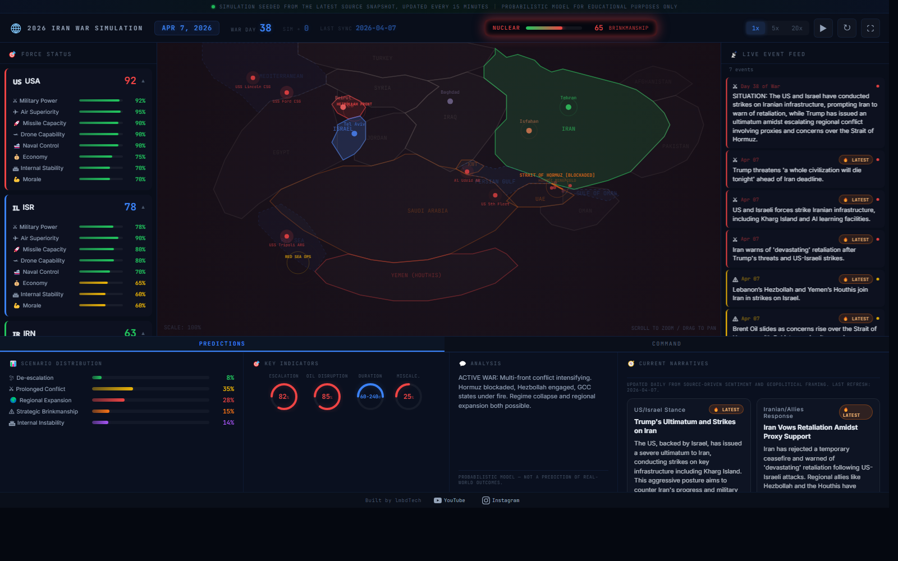

# 2026 Iran War Strategic Simulation

A live, source-informed dashboard for exploring escalation, ceasefire stability, military pressure, economic disruption, and nuclear risk in the 2026 Iran war scenario.

**[Live Demo](https://iranuswarsim.mrsaddemon.workers.dev/)** | **[war.limboidtech.com](https://war.limboidtech.com)**

  

---



---

## Overview

This project is an interactive conflict simulation designed for educational and scenario-exploration purposes. It combines a live event feed, evolving strategic indicators, and a regional map to help users understand how conflict conditions can change over time.

The app is built to feel immediate and readable for public users without requiring technical knowledge of the underlying model. The starting state is refreshed from external reporting, carries a source snapshot into the simulation, and can now surface ceasefire conditions as a distinct state instead of treating them like generic diplomacy noise.

## What You Can Do

- Track force status for the United States, Israel, and Iran
- Watch live simulation updates on the regional map
- Explore strategic pressure across military, economic, and nuclear indicators
- See when an active or fragile ceasefire is shaping the simulation
- Review source-driven event updates and narrative framing
- Interact with the simulation through country-specific command options

## Live Data and Updates

The simulation is refreshed from external news and data sources on a recurring schedule. These updates are used to keep the starting snapshot aligned with the latest available reporting and broader geopolitical conditions.

Update cadence:
- core update cycle: every 15 minutes
- narrative refresh: once per day
- open clients auto-refresh when a newly deployed scheduled update is detected

## Tech Stack

- React + Vite
- Hybrid D3 + Canvas map renderer
- JavaScript simulation engine
- Cloudflare deployment
- GitHub Actions automation

## Run Locally

```bash
git clone https://github.com/mrsaddemon/iranwar2026.git
cd iranwar2026
npm install
npm run dev
```

Open `http://localhost:3000`

To create a production build:

```bash
npm run build
```

## Disclaimer

This is a probabilistic simulation for educational use only. It is not a prediction engine, intelligence product, or real-world operational tool. The model simplifies complex events and should be understood as a scenario-exploration interface, not a factual forecast of future outcomes.

## Credits

Built by [lmbdTech](https://www.youtube.com/@lmbdTech)

- [YouTube](https://www.youtube.com/@lmbdTech)
- [Instagram](https://www.instagram.com/lmbdtech/)
